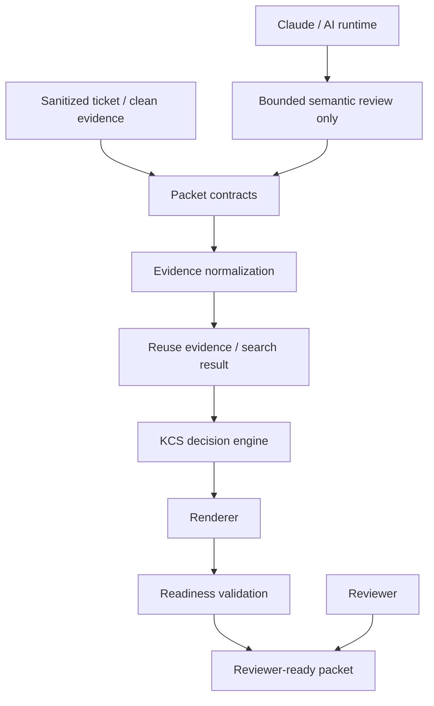

# Policy-Governed AI Support Workflow Core

A production-like Python workflow core for AI-assisted technical support, KCS authoring task.

This project is a contract-driven workflow where AI may help with bounded semantic review or drafting, while deterministic Python code owns validation, KCS action recommendations, readiness checks, reviewer artifacts, and publication safety.

Core principle:

```text
Code decides.
LLM assists.
Validators block.
Reviewers approve.
```

## What this project is

This repository implements a policy-governed KCS authoring core.

It accepts sanitized support evidence, normalizes it into structured packets, evaluates reuse/search evidence, recommends a KCS action, validates readiness, and produces reviewer-only artifacts.

The core is runtime-independent. It can be called by a CLI, Claude Desktop through a local MCP adapter, a future reviewer UI, or an approved internal service.

AI is treated as a bounded reasoning runtime, not as the source of truth for safety, KCS decisions, readiness, or publication.

## What problem it solves

Support tickets are noisy. One ticket can contain multiple issues, partial fixes, customer-specific context, existing article references, and incomplete resolution steps.

The workflow helps a support engineer answer:

* Is this one KCS item or several?
* Is there already an existing article?
* Should we create, update, reuse, flag, block, or do nothing?
* Is the evidence complete enough for reviewer-ready output?
* What risks or blockers must a reviewer see?

The goal is to reduce time-to-reviewer-ready KCS output while keeping human ownership of the final decision.

Success criteria:

* faster KCS preparation;
* lower cognitive cost for support engineers;
* safe use of sanitized evidence;
* deterministic gates for decisions and blockers;
* human final decision;
* no publication risk.

## Main workflow

```text
Sanitized ticket fixture
        ↓
Normalized evidence packet
        ↓
Reuse/search result
        ↓
KCS action recommendation
        ↓
Draft/update/flag/no-article/blocker
        ↓
Validation checks
        ↓
Reviewer-ready packet
```

The workflow can utilize reuse/search evidence from fixtures, explicit KB references in clean-ticket evidence, or a approved search adapter (intentionally not connected here to keep the demo light).

## Demo

The showcase artifact is:

```text
outputs/demo/multi_candidate_reviewer_packet/reviewer_packet.md
outputs/demo/multi_candidate_reviewer_packet/reviewer_packet.json
```

In the standalone showcase folder, the same artifact is provided as:

```text
reviewer_packet.md
reviewer_packet.json
main_workflow.mmd
architecture.mmd
```

The demo ticket contains multiple possible KCS items. The workflow does not collapse them into one article. It produces separate candidate outcomes:

* `candidate-001`: `flag_existing`
  An explicit public KB reference was detected in clean-ticket evidence. The workflow avoided duplicate article creation and produced a reviewer-only flag packet.

* `candidate-002`: `draft_only`
  A reviewer bundle exists, but the item is not KCS-ready because live reuse search was not connected for this demo.

* `candidate-003`: `blocked`
  The ticket identified a likely IPv6 firewall cause, but did not contain exact operator-confirmed firewall procedure details. The workflow blocked the candidate instead of inventing commands.

For this demo, reuse handling is explicit-reference detection, not live RAG search. The existing article body was not fetched, read, or used as source content.

## Architecture



Python owns:

* packet contracts;
* data-handling rules;
* evidence normalization;
* KCS action recommendation;
* blockers;
* readiness state;
* reviewer packet rendering;
* publish-safety flags.

Claude or another AI runtime can help identify candidate KCS items from bounded clean-ticket excerpts, but its output is validated before the workflow continues.

### Key modules

The core is organized around explicit workflow responsibilities:

* `src/kcs_core/sanitizer.py`: value-safety and sanitized payload checks.
* `src/kcs_core/evidence_builder.py`: normalized evidence packet construction.
* `src/kcs_core/decision.py`: deterministic KCS action recommendations.
* `src/kcs_core/renderer.py`: reviewer packet and Zendesk HTML rendering.
* `src/kcs_core/readiness.py`: final validation and reviewer readiness.
* `src/kcs_adapters/mcp_desktop.py`: local Claude Desktop MCP surface.
* `src/kcs_adapters/desktop_semantic_review.py`: bounded semantic-review prepare/submit workflow.

The important boundary is that adapters can call the workflow, but they do not own KCS decisions. The Python core owns contracts, validation, decisions, rendering, readiness, and publish-safety flags.

Current Claude Desktop operator-facing aliases include:

* `kcs_draft_article`
* `kcs_prepare_semantic_review`
* `kcs_submit_semantic_review`

## Safety and privacy boundaries

The workflow is safe by default:

* raw Zendesk data is not sent to Claude by default;
* only sanitized or approved clean-ticket evidence is used for AI-facing handoff;
* AI output is treated as untrusted input;
* reviewer artifacts are local and reviewer-only;
* `auto_publish_allowed=false`;
* `public_output_approved=false`;
* no Zendesk write is performed;
* no Help Center publication is performed;
* no customer reply is generated.

Safety is enforced by code and validation, not only by prompts.

## KCS authoring workflow

Supported KCS actions:

* `reuse_existing`
* `update_existing`
* `flag_existing`
* `create_candidate`
* `split_required`
* `no_article`
* `blocked`

The Desktop adapter can also return `draft_only` when a reviewer bundle was written but the item is not KCS-ready because reuse/search was skipped.

The final KCS decision remains with the support engineer, KCS reviewer, or publisher.

The workflow is designed to make uncertainty visible. Missing evidence becomes a blocker. Skipped reuse search prevents KCS-ready promotion. Existing article references prevent duplicate creation. Multi-issue tickets are split instead of merged.

## Evaluation / golden cases

The project is designed around deterministic tests and showcase fixtures.

Covered or expected golden paths:

* clean single-item draft;
* multi-candidate split;
* explicit existing article reference;
* `flag_existing`;
* `draft_only` when reuse search is skipped;
* blocker when resolution evidence is incomplete;
* reviewer packet rendering;
* publication-safety flags.

Useful checks:

```bash
uv run pytest -q
uv run ruff check src scripts tests
uv run python -m json.tool outputs/demo/multi_candidate_reviewer_packet/reviewer_packet.json
```

## What this proves

This project proves that an AI-assisted support workflow can be useful without giving the model control over KCS decisions or publication.

It demonstrates:

* structured candidate extraction from noisy support evidence;
* deterministic KCS action recommendations;
* explicit evidence and provenance recording;
* duplicate-article prevention through reuse evidence;
* blocker behavior when evidence is incomplete;
* reviewer-ready artifacts instead of raw AI answers;
* production-like safety boundaries before service deployment.

## What this does not prove

This project does not yet prove:

* live RAG/search quality;
* online article-body comparison;
* Zendesk write readiness;
* Help Center publication readiness;
* customer-reply generation;
* full enterprise deployment.

The current showcase uses explicit-reference detection, not a live reuse-search backend.

## Roadmap

Near-term:

* add more golden cases for create, update, reuse, flag, split, no-article, and blocked paths;
* keep explicit-reference detection separate from live reuse search;
* connect an approved reuse/search adapter with clear provenance fields;
* harden reviewer packet snapshots and schema compatibility tests;
* improve reviewer packet styling and KCS format parity;
* introduce a small policy-as-data layer for repeated declarative rules, starting with one file, one engine, a strict schema, and regression tests.

Policy-as-data scope should stay limited at this stage:

* forbidden output surfaces;
* blocker and warning code metadata;
* simple article-shape requirements;
* simple decision-table rows;
* quality rubric dimensions.

Python remains the policy engine. Policy files describe repeated rule data; Python owns normalization, schema validation, recursive scanning, decision execution, rendering, and readiness aggregation.

Later:

* add reviewer override/reject states;
* add audit metadata for reviewer decisions;
* report which policy rule fired, which policy version was used, and which evidence supported the result;
* use reviewer outcomes and golden cases to propose policy/rule updates offline;
* move local runtime behavior behind an approved internal service boundary;
* add CI/CD, observability, and deployment only if the pilot moves toward internal service use;
* keep Zendesk writes and publication behind separate approval gates.
