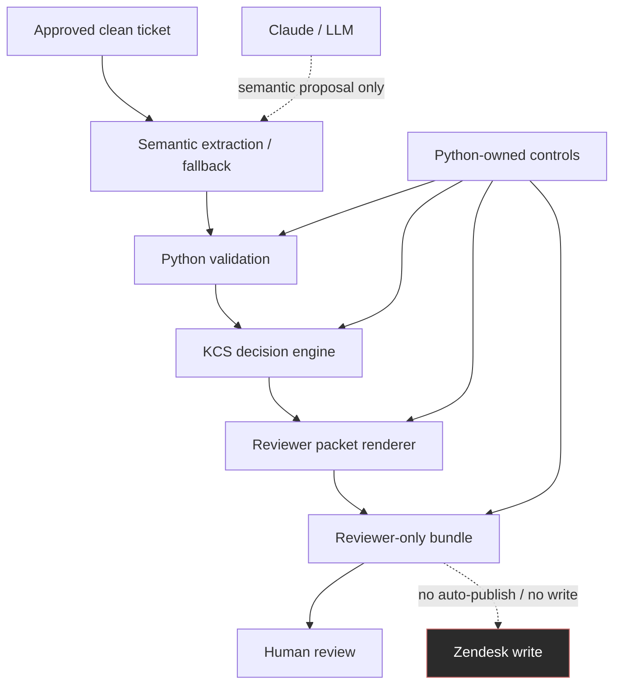

# KCS Authoring Workflow Walkthrough

This project demonstrates a policy-governed AI-assisted KCS Authoring workflow
for technical support. It turns approved clean ticket evidence into
reviewer-ready KCS action packets while keeping AI output bounded and
reviewable. Claude or another LLM assists with semantic understanding, while
Python owns validation, decision logic, blocker handling, rendering, bundle
writing, and publication safety controls.

## Problem

The workflow addresses two connected problems: support/KCS authoring overhead
and the risk of making an LLM the center of decision-making.

Support tickets are noisy. A single ticket can contain several issues, partial
fixes, product-specific details, links to existing knowledge, and missing
resolution evidence. Reconstructing that context manually adds preparation
overhead for support engineers at the end of already complex support work.

Blindly generating a new KB article from that context creates duplicate content
and review risk. Putting a whole ticket directly into an LLM also creates
security and privacy risk, excessive token use, and non-deterministic workflow
results. AI can help summarize approved clean evidence and identify candidate
knowledge actions, but AI output should not be treated as publishable truth or
as the owner of workflow decisions.

Reviewers need an artifact that exposes the evidence basis, provenance, reuse
status, risks, blockers, and the exact action being recommended.

This workflow is designed to reduce KCS preparation overhead by externalizing
the information an engineer normally has to keep in mind: candidate issue
boundaries, evidence basis, reuse status, blockers, validation state, and
reviewer next steps. The current demo does not measure cognitive-load reduction
directly. It demonstrates a plausible mechanism for reducing it: the workflow
turns noisy clean-ticket evidence into structured reviewer packets, so the
engineer does not have to reconstruct the entire KCS decision context from
memory.

## Workflow Overview

```text
Approved clean ticket
  -> semantic extraction / fallback
  -> Python validation
  -> KCS decision engine
  -> renderer
  -> reviewer packet
  -> human review
```

Responsibility split:

| Owner | Responsibility |
| --- | --- |
| Claude / LLM | Semantic proposal, candidate extraction, draft assistance only |
| Python | Validation, KCS action decision, blocker/warning state, reviewer packet rendering, bundle writing, publication safety |
| Human reviewer | Final reuse, update, create, split, block, discard, or publish decision |

Core principle:

```text
Code decides.
LLM assists.
Validators block.
Reviewers approve.
```

## Architecture Diagram



## Demo Scenarios

| Demo | Scenario | Purpose |
| --- | --- | --- |
| Demo 1 | Simple clean ticket from local store / deterministic Python extraction | Shows the local clean-ticket path without LLM-owned extraction |
| Demo 2 | Noisy ticket + AI semantic extraction by LLM | Shows bounded semantic assistance when Python extraction needs help |
| Demo 3 | Noisy multi-issue / `flag_existing` + `draft_only` + blocked | Primary showcase for controlled workflow behavior |
| Demo 4 | Hardest fallback / semantic review required | Backup deep-dive for complex ticket interpretation |

Demo 3 is the primary walkthrough because it is the clearest controlled case:
one noisy clean ticket, multiple possible KCS outcomes, reuse behavior, blocker
behavior, bounded AI assistance, and Python-owned decisions.

## Demo 3 Showcase

Demo 3 uses a noisy multi-issue support case. The primary candidate identifies
an Apache startup failure in Plesk related to a missing or empty
`SSLCACertificateFile` reference in generated Apache configuration.

The workflow detects that an existing public KB article likely covers the same
issue identity. It selects `flag_existing` instead of creating a duplicate
article. A secondary candidate remains `draft_only` because reuse search was
skipped. Another candidate is blocked because the clean ticket does not contain
operator-confirmed resolution procedure details.

Demo 3 shows that the workflow does not treat AI output as automatically
publishable. It checks evidence, avoids duplicate article creation, records why
the output exists, exposes blockers, and keeps the human reviewer in control.

For this showcase run, reuse handling is based on explicit-reference detection
from approved clean-ticket evidence, not live RAG search. No online article body
comparison is claimed by the demo.

## Showcase Packet Files

Sanitized public-safe showcase copies live under
[`showcase/demo-3/`](showcase/demo-3/):

| File | Purpose |
| --- | --- |
| [`README.md`](showcase/demo-3/README.md) | Short packet guide for Demo 3 |
| [`reviewer_packet.md`](showcase/demo-3/reviewer_packet.md) | Human-readable reviewer packet |
| [`reviewer_packet.json`](showcase/demo-3/reviewer_packet.json) | Machine-readable structured packet |
| [`preview.html`](showcase/demo-3/preview.html) | Sanitized reviewer-only preview of the primary candidate |
| [`architecture.mmd`](showcase/demo-3/architecture.mmd) | Mermaid architecture diagram source |

The packet is reviewer-only. It is not public Help Center content, not a
Zendesk write, not auto-published, and not a customer reply. It is based on
approved clean-ticket evidence and intended for human review.

## Privacy And Data Boundary

The demo flow can run on approved sanitized real tickets in the local/internal
environment. Public showcase examples use synthetic or anonymized ticket
references only.

Public-facing examples must not expose real Zendesk ticket IDs, customer
domains, hostnames, emails, names, operators, private paths, internal URLs,
customer-identifying timestamps, raw ticket text, or raw internal/Rovo context.

Public command example:

```text
/draft ticket-1234567
```

The example reference is synthetic. Internal command examples and run-specific
bundle paths should stay separate from public showcase material.

## What This Proves

This demonstrates:

- controlled AI-assisted support/KCS workflow;
- a plausible mechanism for reducing KCS preparation overhead;
- bounded LLM assistance without making the model the center of decision-making;
- clean-evidence handoff instead of sending the whole raw ticket to the model;
- workflow shape that can lower token exposure through compact inputs and reviewer artifacts;
- Python-owned validation, decisions, rendering, blocker state, and publish-safety controls;
- multi-candidate handling from one noisy ticket;
- reuse/flag behavior to avoid duplicate article creation;
- blocker and `draft_only` handling when evidence is incomplete;
- reviewer-ready artifact generation;
- privacy-aware local/internal workflow;
- no auto-publication and no Zendesk write;
- human reviewer remains the final authority.

## Current Status And Boundaries

| Area | Status |
| --- | --- |
| Clean-ticket input | Supported for approved local/internal flow |
| Reviewer packet generation | Implemented |
| Machine-readable packet JSON | Implemented |
| Human-readable reviewer packet | Implemented |
| KCS action recommendation | Implemented |
| Multi-candidate ticket handling | Demonstrated |
| Auto-publish | Blocked by design |
| Zendesk writes | Blocked by current safety gates; production write path deferred |
| Reviewer approval | Required |
| Claude / LLM ownership | Semantic assistance only |
| Python ownership | Validation, decisions, rendering, bundle output, publish-safety controls |
| Workflow core | Demonstrated locally |
| Enterprise rollout | Not claimed |

## How To Review The Packet

Review order:

1. Check the selected KCS action.
2. Check evidence basis and provenance.
3. Check reuse/search provenance and whether live search was performed.
4. Check the selected existing article, if any.
5. Check validation results.
6. Check blockers and warnings.
7. Check `draft_only` candidates.
8. Confirm that no output is treated as public or publishable without review.
9. Decide whether to reuse, flag, update, create, split, block, or discard.

Trust:

- structured packet fields;
- validation results;
- blocker/warning codes;
- explicit provenance.

Do not blindly trust:

- model-written wording;
- inferred root cause without evidence;
- article draft text without reviewer verification;
- any candidate marked blocked or `draft_only`.

## Demo Command Path

```text
/draft ticket-1234567
  -> loads approved clean ticket artifact
  -> runs semantic extraction / fallback
  -> validates candidate extraction
  -> applies KCS decision engine
  -> writes reviewer-only bundle
```

The command example is intentionally synthetic. Real ticket references and local
bundle paths belong only in approved internal/local review material.

## Pilot Q&A Appendix

This walkthrough does not answer every possible leadership-level question, but
it answers most first-level questions for a 3-5 minute introduction.

Already answered:

- What is it? A policy-governed AI-assisted KCS workflow, not a chatbot.
- Who owns decisions? Python owns validation, decision logic, blockers, rendering, bundle writing, and publication safety.
- What does Claude do? Semantic proposal, candidate extraction, and draft assistance only.
- What is the demo proof? Demo 3 shows `flag_existing`, `draft_only`, and blocked outcomes from one noisy ticket.
- What are the privacy boundaries? Public examples must not expose real ticket IDs, customer domains, names, private paths, raw ticket text, or internal context.
- What is not claimed? No auto-publication, no Zendesk write, no enterprise rollout, and no live enterprise RAG integration.

Likely follow-up questions:

| Area | Likely question | Current answer |
| --- | --- | --- |
| Business value | How much time does this save per article? | Not measured yet; pilot should capture baseline and assisted preparation time. |
| Business value | How many KCS candidates per week or month? | Requires support-team ticket volume and KCS candidate rate. |
| Evaluation | How is quality measured? | Partially implemented: deterministic fixtures and tests cover action decisions, schema/readiness, blockers, renderer output, and markup quality. Missing: a consolidated golden-case rubric and reviewer-usability evaluation. |
| Integration path | Where would this live in an internal pilot? | Likely local/internal workflow first, connected to approved clean-ticket input and reviewer bundle output before write integrations. |
| Security / governance | Who approves sanitized input? | Pilot must define the approving operator, allowed fields, artifact storage, and log retention. |
| Security / governance | What prevents raw data from entering Claude? | Current design uses approved clean-ticket evidence, bounded excerpts, and Python validation; pilot should add operational controls and audit checks. |
| Cost and scale | What is the token/cost model? | Current demo proves bounded handoff shape; live pilot should record token use by path and compare deterministic vs semantic fallback frequency. |
| Ownership | Who maintains rules and validators? | Needs explicit support/KCS owner plus engineering owner for policy rules, validators, and release gates. |

Pilot preparation should define:

- business value hypothesis;
- pilot scope and operator group;
- success metrics;
- quality rubric and golden cases;
- security boundary and artifact retention;
- integration path;
- cost assumptions;
- support-team responsibilities;
- explicit out-of-scope items.

## Deferred Items

Deferred:

- consolidated golden-case evaluation rubric;
- reviewer-usability feedback/scoring during pilot review;
- SkCC / multi-agent instruction compiler packaging;
- production Zendesk write path;
- auto-publication;
- live enterprise RAG integration;
- large runtime feature expansion.

These are deferred because this walkthrough is presentation polish for the
existing workflow core, not a request to add runtime scope.
